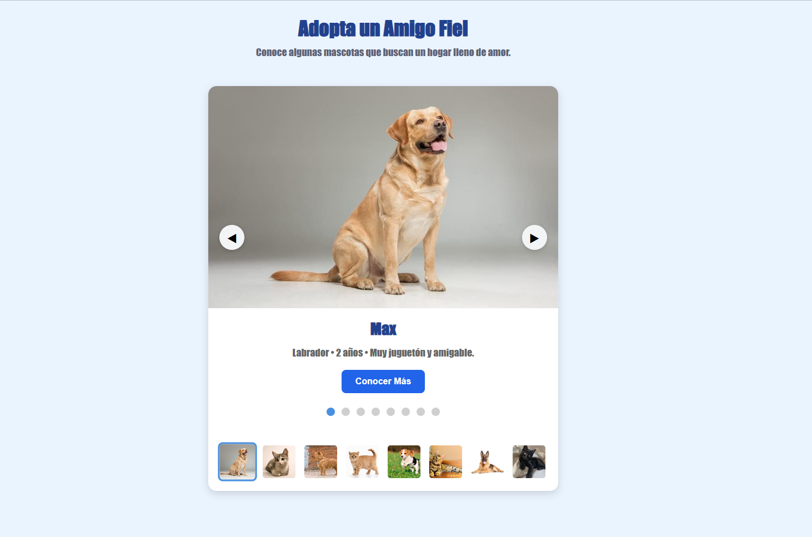
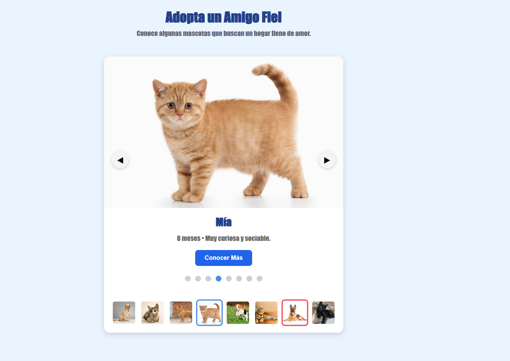
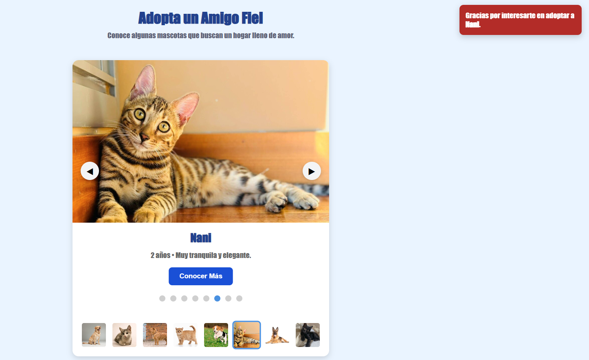

# Actividad 3. Componente Visual con JS

# SliderJS

### Componente visual reutilizable con Toast integrado

---

## Instituto Tecnológico de Oaxaca

**Materia:** Programación Web  
**Periodo:** Verano 2026

**Ingeniería en Sistemas Computacionales**


---

**Docente:**  
Mtra. Adelina Martínez Nieto

**Alumno:**  
Mendoza Jimenez Melody Nathalie

**No. de Control:** 23161034

---

# Objetivo

Desarrollar un componente visual reutilizable utilizando HTML, CSS y JavaScript, capaz de mostrar imágenes de forma interactiva mediante un slider e incorporar un componente Toast para mostrar mensajes temporales al usuario. Además, se busca que el componente pueda reutilizarse en diferentes proyectos cambiando únicamente la información que se desea mostrar, sin modificar el funcionamiento de la librería.

---

# Descripción

SliderJS es un componente visual desarrollado con **HTML, CSS y JavaScript** que permite mostrar una galería de imágenes de forma interactiva.

El componente incluye:

- Navegación mediante botones para avanzar y retroceder.
- Indicadores para identificar la imagen actual.
- Miniaturas que permiten seleccionar cualquier imagen.
- Un componente Toast integrado que muestra mensajes temporales al usuario sin cambiar de página.
- Información dinámica (título y descripción) para cada imagen.

El Toast puede personalizarse al momento de utilizar el componente, por lo que puede mostrar diferentes mensajes según el proyecto donde se implemente.

La demostración del componente se realizó con una galería de mascotas en adopción; sin embargo, puede reutilizarse para mostrar cualquier tipo de contenido como productos, platillos, lugares turísticos, vehículos, entre otros.

---

# ¿Qué problema resuelve?

Cuando se desea mostrar varias imágenes dentro de una página web, normalmente ocupan mucho espacio y la información puede verse desordenada.

Este componente permite organizar las imágenes en un solo espacio, mostrando únicamente una a la vez junto con su título y descripción.

Además, permite que el usuario navegue fácilmente utilizando:

- Flechas
- Miniaturas
- Indicadores
- Mensajes de confirmación mediante Toast

---

# Toast integrado

Además del slider, la librería incluye un componente tipo **Toast**, el cual muestra un mensaje temporal cuando el usuario realiza una acción.

En la demostración del proyecto, el Toast aparece al presionar el botón **Conocer Más**, mostrando un mensaje relacionado con la mascota seleccionada.

Una ventaja es que el mensaje no está fijo, ya que puede personalizarse al momento de llamar al componente, permitiendo utilizar el mismo Toast en diferentes proyectos.

---

# Estructura del proyecto

```text
Actividad3-ComponenteVisual/

│
├── index.html
├── README.md
│
├── css
│   └── componente.css
│
├── js
│   └── componente.js
│
└── img
    ├── max.jpg
    ├── luna.jpg
    ├── rocky.jpg
    ├── mia.jpg
    ├── toby.jpg
    ├── nani.jpg
    ├── bruno.jpg
    └── kira.jpg
```

---

# Instalación

Para utilizar el componente solamente es necesario agregar el archivo CSS y el archivo JavaScript dentro del proyecto.

```html
<link rel="stylesheet" href="css/componente.css">

<script src="js/componente.js"></script>
```

Después se crea un contenedor donde aparecerá el slider.

```html
<div id="slider"></div>
```

---

# Uso del componente

Primero se crea un arreglo con la información que se desea mostrar.

```javascript
var mascotas = [

    {
        imagen:"img/max.jpg",
        titulo:"Max",
        descripcion:"Labrador • 2 años • Muy juguetón y amigable."
    },

    {
        imagen:"img/luna.jpg",
        titulo:"Luna",
        descripcion:"Gatita • 1 año • Cariñosa y tranquila."
    }

];
```

Después únicamente se llama al componente.

```javascript
crearSlider(
    "slider",
    mascotas,
    "Gracias por interesarte en adoptar a "
);
```

| Parámetro | Descripción |
|-----------|-------------|
| `"slider"` | Identificador del contenedor donde aparecerá el componente. |
| `mascotas` | Arreglo con las imágenes, títulos y descripciones que se mostrarán. |
| `"Gracias por interesarte en adoptar a "` | Mensaje que utilizará el Toast al presionar el botón del componente. |

---

# Ejemplo de reutilización

El Slider y el Toast pueden reutilizarse sin modificar la librería.

Únicamente es necesario cambiar el arreglo de datos y el mensaje que recibirá el Toast.

### Catálogo de postres

```javascript
crearSlider(
    "slider",
    postres,
    "Agregaste a tu pedido: "
);
```

### Destinos turísticos

```javascript
crearSlider(
    "slider",
    destinos,
    "Has seleccionado el destino "
);
```

### Productos

```javascript
crearSlider(
    "slider",
    productos,
    "Producto agregado al carrito: "
);
```

---

# Componentes incluidos

La librería desarrollada integra los siguientes componentes visuales:

✔ Slider de imágenes interactivo.

✔ Indicadores de navegación.

✔ Miniaturas para cambiar de imagen.

✔ Toast reutilizable con mensaje personalizable.

---

# Capturas de pantalla

## Vista principal


<p align="center">

</p>

---

## Cambio entre imágenes


<p align="center">

</p>

---

## Toast

Su función es mostrar un mensaje temporal relacionado con la imagen seleccionada. Este mensaje puede modificarse fácilmente al utilizar la librería en otro proyecto.


<p align="center">

</p>

---

# Video de demostración

El siguiente video muestra el funcionamiento del componente y una breve explicación de su reutilización.

**Ver video en YouTube:** https://youtu.be/MjhHcnbD9HI

---

# Tecnologías utilizadas

- HTML
- CSS
- JavaScript

---

# Autor

**Melody Nathalie Mendoza Jiménez**

Estudiante de: Ingeniería en Sistemas Computacionales

Verano 2026